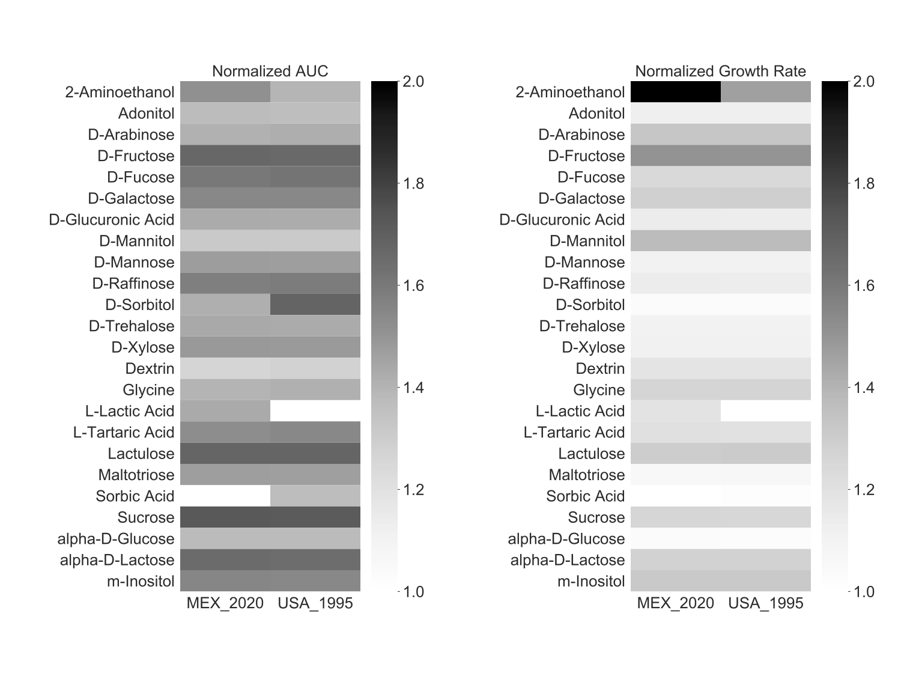
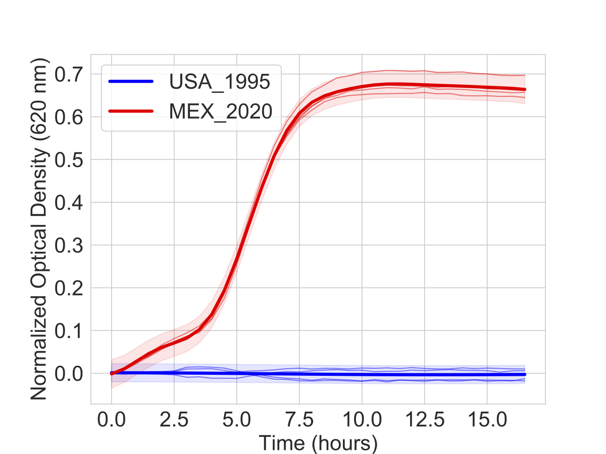
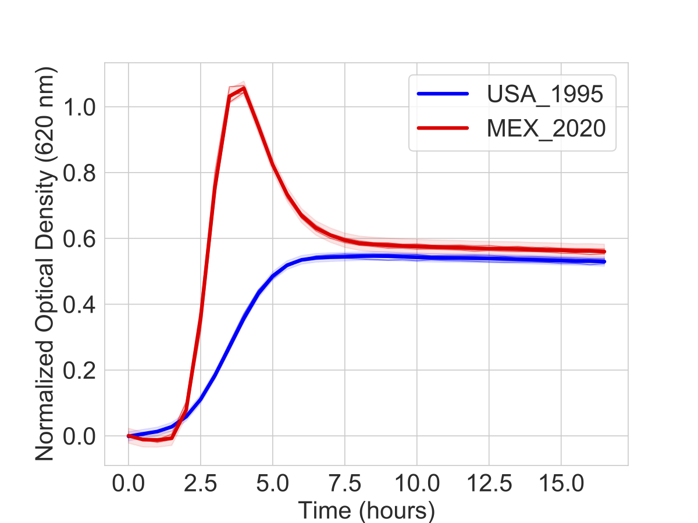
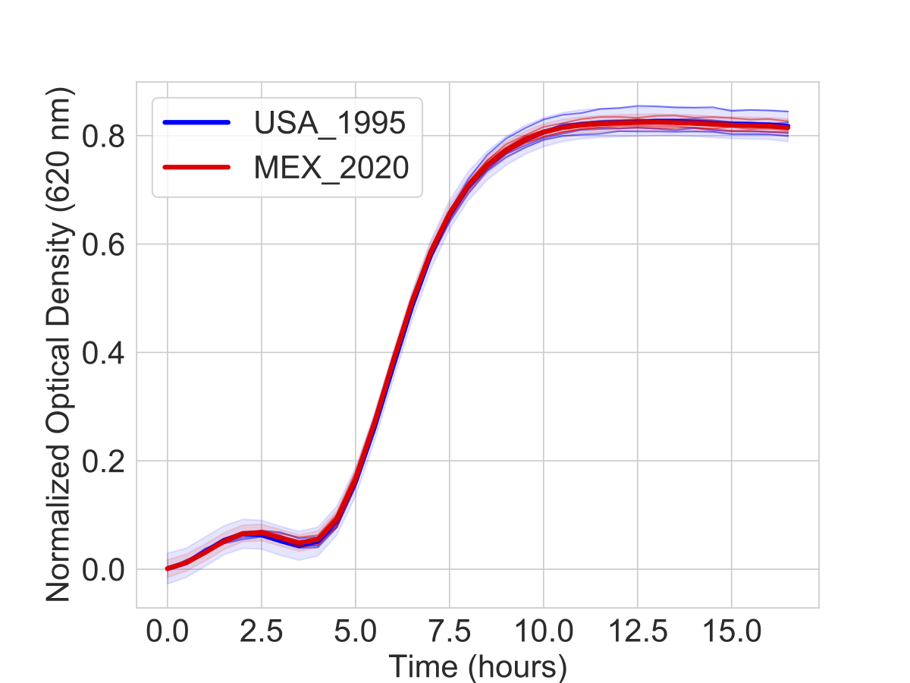

**Hypothetical scenario**
<br /><br/>
You are the leading global expert on the human pathogen *Examploides randomii*. Diligent work by your lab has previously analyzed its outbreak in the United States of America (USA) in 1995. One week ago, you received a phone call from Mariana, an epidemiologist in Mexico. *E. randomii* is emerging in the the state of Yucatán. Mariana has been tracking the outbreak and is wondering if the emerging strain may be related to the 1995 outbreak in Florida, USA. She has sent you two clinical isolates of *E. randomii* overnight. You revived two clinical isolates from frozen stocks of the 1995 outbreak. You asked your colleague, Kai, to sequence and compare the genomes of all of the isolate. In the meantime, you profiled the carbon substrate utilization of all isolates using Biolog Phenotype Microarray (PM) plates 1 and 2. All profiles were performed in duplicates.
<br /><br/>
**Preparing your data for analysis**
<br /><br/>
You created a working directory in `/home/outbreaks/erandomii` and saved the result from your plate reader in `/home/outbreaks/erandomii/data`.
<br /><br/>
You also created the following table describing your files and saved it as the tab-delimited mapping file `/home/outbreaks/erandomii/mapping/meta.txt`
<br /><br />

|Plate_ID|Species|Strain|Isolate|PM|Replicate|
|:---|:---|:---|:---|:---|:---|
|ER1_PM1-1|E randomii|USA 1995|ER1|1|1|
|ER1_PM1-2|E randomii|USA 1995|ER1|1|2|
|ER1_PM2-1|E randomii|USA 1995|ER1|2|1|
|ER1_PM2-2|E randomii|USA 1995|ER1|2|2|
|ER2_PM1-1|E randomii|USA 1995|ER2|1|1|
|ER2_PM1-2|E randomii|USA 1995|ER2|1|2|
|ER2_PM2-1|E randomii|USA 1995|ER2|2|1|
|ER2_PM2-2|E randomii|USA 1995|ER2|2|2|
|ER3_PM1-1|E randomii|MEX 2020|ER3|1|1|
|ER3_PM1-2|E randomii|MEX 2020|ER3|1|2|
|ER3_PM2-1|E randomii|MEX 2020|ER3|2|1|
|ER3_PM2-2|E randomii|MEX 2020|ER3|2|2|
|ER4_PM1-1|E randomii|MEX 2020|ER4|1|1|
|ER4_PM1-2|E randomii|MEX 2020|ER4|1|2|
|ER4_PM2-1|E randomii|MEX 2020|ER4|2|1|
|ER4_PM2-2|E randomii|MEX 2020|ER4|2|2|

<br />
**Plotting your data**
<br /><br/>
You are curious about the quality of your results. Is the pathogen growing in at least some of the wells? Is the data noisy? Do you need to repeat any plates?
<br /><br/>
You downloaded `AMiGA` (see Installation) and made sure you are in the correct directory.

```bash
cd /home/programs/amiga
```

You started analyzing your data by simply plotting the files.

```bash
python main.py -i /home/outbreaks/erandomii/ --only-basic-summary
```

You found the following files in your `figures` folders:
<br /><br/>
`ER1_PM1-1.pdf`<br/>
`ER1_PM1-2.pdf`<br/>
`ER1_PM2-1.pdf`<br/>
`ER1_PM2-2.pdf`<br/>
`ER2_PM1-1.pdf`<br/>
`ER2_PM1-2.pdf`<br/>
`ER2_PM2-1.pdf`<br/>
`ER2_PM2-2.pdf`<br/>
`ER3_PM1-1.pdf`<br/>
`ER3_PM1-2.pdf`<br/>
`ER3_PM2-1.pdf`<br/>
`ER3_PM2-2.pdf`<br/>
`ER4_PM1-1.pdf`<br/>
`ER4_PM1-2.pdf`<br/>
`ER4_PM2-1.pdf`<br/>
`ER4_PM2-2.pdf`<br/>
<br/>
and the following file sin your `summary` folders:
`ER1_PM1-1.txt`<br/>
`ER1_PM1-2.txt`<br/>
`ER1_PM2-1.txt`<br/>
`ER1_PM2-2.txt`<br/>
`ER2_PM1-1.txt`<br/>
`ER2_PM1-2.txt`<br/>
`ER2_PM2-1.txt`<br/>
`ER2_PM2-2.txt`<br/>
`ER3_PM1-1.txt`<br/>
`ER3_PM1-2.txt`<br/>
`ER3_PM2-1.txt`<br/>
`ER3_PM2-2.txt`<br/>
`ER4_PM1-1.txt`<br/>
`ER4_PM1-2.txt`<br/>
`ER4_PM2-1.txt`<br/>
`ER4_PM2-2.txt`<br/>
<br />
Gladly, all figures look fine. The pathogen seems to be growing in some of the wells in each of the PM1 and PM2 plates. There are some minor difference that you can spot by eye between the Mexican and American isolates. But you will fit the growth curves first to confirm your observations.
<br /><br/>
**Fitting growth curves**

```bash
python main.py -i /home/outbreaks/erandomii
```

The files in your `summary` files were updated to include inferred growth parameters for each well. You looked at these results in your favorite data analysis software (e.g. Microsoft Excel, Python, R, ... etc.). For example, you normalized all of the growth parameters relative to the relevant control well ('A1' in biolog plates). Then, you averaged these normalized parameters within each strain. Finally, you plotted the normalized AUC and Growth Rates  as heat-maps and focused on substrates with normalized AUC higher than 1.2.

{:width="700px"}

You made the following observations:

- Only the MEX_2020 strain grows on L-Lactic Acid.
- Only the USA_1995 strain grow on Sorbic Acid..
- MEX_2020 strain seems to grow much better on 2-Aminoethanol.
- USA_1995 strain seems to grow much better on D-Sorbitol.
- MEX_2020 strain seems to grow more rapidly on 2-Aminoethanol than USA_1995.
- Capric Acid is toxic to both strains.

<br />

**Simple Hypothesis Testing**

Based on your observations, you formulated several hypothesis. You can test for those quickly with AMiGA. For example, you tested for differential growth on L-Lactic Acid between the two strains using the following command.

```bash
python main.py -i /home/outbreaks/erandomii -s 'Substrate:L-Lactic Acid' -y 'H0:Time;H1:Time+Strain' -o 'strain_difference_l_lactic_acid' -np 99 -nt 3
```

This will produce four files in the `models` folders:

- `strain_difference_lactic_acid_key.txt`
- `strain_difference_lactic_acid_input.txt`
- `strain_difference_lactic_acid_output.txt`
- `strain_difference_lactic_acid.pdf`

<br />

The figure will show the models estimated for each strain (bold lines) overlaid on the actual data (thin lines). Shaded bands indicate the 95% confidence interval for the models.

{:width="400px"}

<br />

The output report will look like this:

```
The following criteria were used to subset data:
Substrate......['L-Lactic Acid']

The following hypothesis was tested on the data:
{'H0': ['Time'], 'H1': ['Time', 'Strain']}

log Bayes Factor: 750.772 (0.0-percentile in null distribution based on 100 permutations)

For P(H1|D) > P(H0|D) and FDR <= 20%, log BF must be > 0.179
For P(H0|D) > P(H1|D) and FDR <= 20%, log BF must be < -4.34e-06

Data Manipulation: Input was reduced to 34 time points. Samples were normalized to relevant control samples before modelling.
```

This indicates that the log Bayes Factor is 750.772 and much higher than the 20% FDR threshold of 0.179. You are every confident that Lactic Acid supports the growth of the MEX_2020 strain but not the USA_1995 strain.

<br />

For an additional illustration of this approach, you tested for differential growth of these strains on `2-Aminoethanol` using the following command:

```bash
python main.py -i /home/outbreaks/erandomii -s 'Substrate:2-Aminoethanol' -y 'H0:Time;H1:Time+Strain' -o 'strain_difference_2_aminoethanol' -np 99 -nt 3
```

The log Bayes Factor was 596.548 and much higher than the 20% FDR threshold of 0.024. You are also confident that the MEX_2020 strain has a faster growth rate on 2-aminoethanol than the USA_1995 strain.

{:width="400px"}

<br />

As a control, you tested for differential growth on D-Xylose. The above heatmap suggests that there is very little difference in AUC or growth rate between the strains.

{:width="400px"}

<br />

As shown above, there is almost no visual difference of the strain-specific models or data. The report also shows that the log Bayes Factor is 0.363 and that the 20% FDR threshold is 0.181. Recall that

$$\text{Bayes Factor} = \exp \left(\log \text{Bayes Factor}}\right) = \exp{0.363} = 1.44$$

and

$$\text{Bayes Factor} = \frac{P(H1|D)}{P(H0|D)}$$

Therefore, the analysis suggest that support for the alternative hypothesis that strain identity contributes to differences in growth is approximately 44% higher than support for the null hypothesis that only time explains variations in optical density measurements. However, because the FDR is set to 20% and because the estimated models do not visually differ, you believe these minute differences detected by the GP regression are more likely explained by batch effects (i.e. random noise).

<br />

**Conclusion**

You discussed the results of you analysis with Kai who has finished sequencing the genome for all of these isolates. He has found mutations in the genes involved in L-Lactic Acid, Sorbic Acid, Sorbitol, and 2-Aminoethanol. Outstanding! Those results match the phenotypic characterization of your isolates. Kai also found out that the Mexican strains are closely related to the strains from 1995 outbreak in the USA but are not a direct lineage. You share those results with Mariana but also formulate new experiments to investigate those metabolic adaptations.
