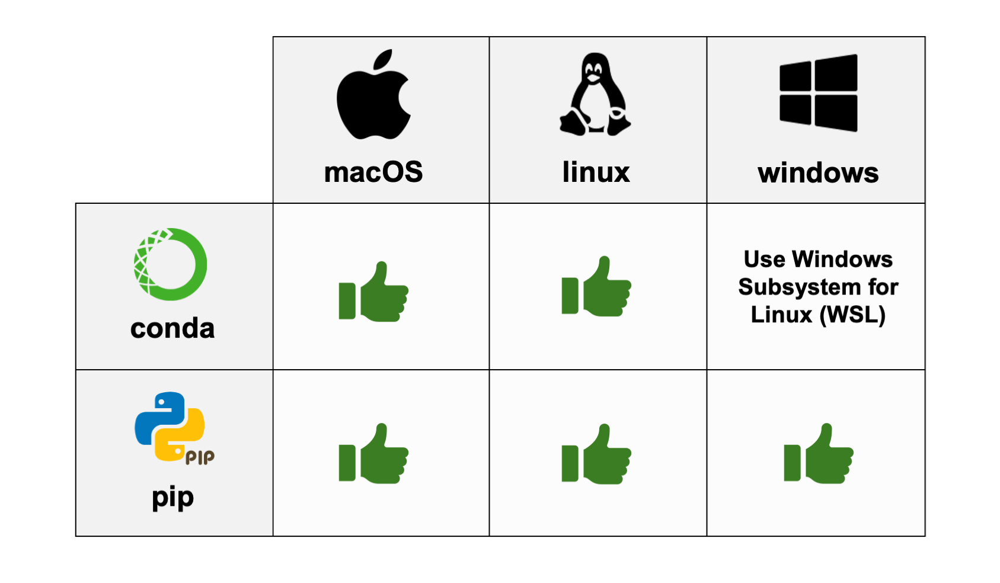

<!-- AMiGA is covered under the GPL-3 license -->

**Table of Contents**

* TOC
{:toc}
<br>

# Overview

 `AMiGA` is available on [`PyPI`](https://pypi.org/project/amiga/) and [`Bioconda`](https://anaconda.org/bioconda/amiga) and is compatible with Python versions 3.10, 3.11, and 3.12. 

{:width="500px"}

<u>Note to Windows users</u>: If you would like to install `AMiGA` with `conda/mamba`, you will need to use the Windows Subsystem for Linux, becuase `AMiGA` is only available through the `bioconda` channel for linux and mac systems. 

<u>Note to all users</u>: To avoid dependency conflicts, I recommend that you create a virtual environment for `AMiGA`. 
* For `pip` users, see  [Install packages in a virtual environment using pip and ven](https://packaging.python.org/en/latest/guides/installing-using-pip-and-virtual-environments/).
* For `conda/mamba` users, see [Managing environments](https://docs.conda.io/projects/conda/en/latest/user-guide/tasks/manage-environments.html).

<br>

# Instructions for Advanced Users

`AMiGA` can be installed by pip or conda/mamba and is compatible with Python 3.10, 3.11, and 3.12. I recommend that you create a virtual environment for `AMiGA`. 

```
pip install amiga
```

```
conda install bioconda::amiga
```

```
mamba install bioconda::amiga
```
<br>

If you would like to build `AMiGA` locally, then do the following.

```
git clone https://github.com/firasmidani/amiga
cd amiga
python3 -m install build
python3 -m build .
python3 -m pip install dist/amiga*whl
```
<br>

You can test your installation by pulling up the help menu.

```
amiga -v              # display AMiGA version numbers
amiga -h              # help menu
amiga summarize -h    # help menu for summarize command
```
<br>

# Instructions for Beginners

These are instructions for beginners who have never used python packages or need a referesher on how to install and run python packages.  


### Installing AMiGA with pip 

I recommend that you install `AMiGA` with `pip` if you use Windows and do not want to install Windows Subsystems for Linux. See detailed instructions [here](/amiga/assets/instructions/2025-03-11-installation-pip.html). 

### Installing AMiGA with conda/mamba

Otherwise, I recommend that you install `AMiGA` with `conda` or `mamba`. See detailed instructions [here](/amiga/assets/instructions/2025-03-11-installation-miniforge.html). 