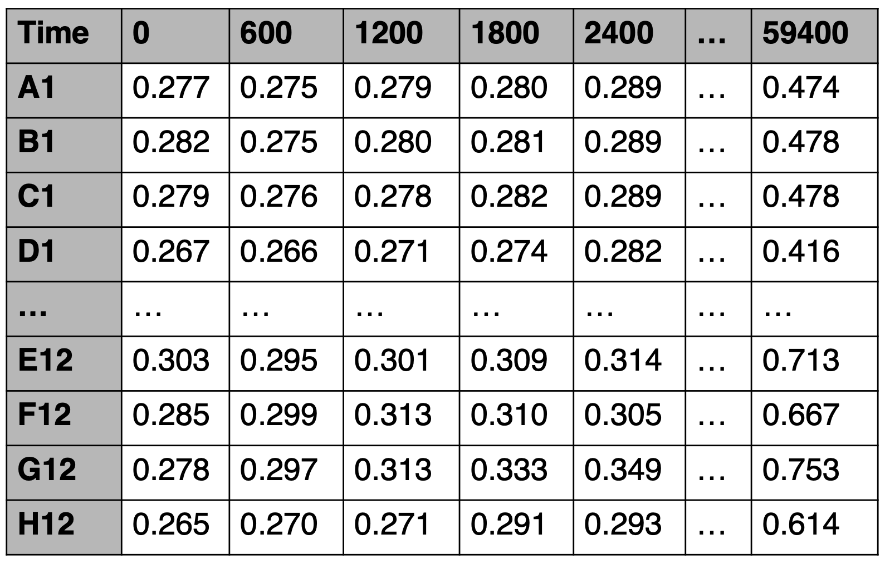

Before you begin with your first analysis, you need to create a folder which we will refer to as the __Working Directory__. Here, I name my example as __experiment__. In this folder, you must have a __data__ sub-folder where you will save all of your data files that need to be analyzed.

  

{:width="500px"}
<!--- {:class="img-responsive"} --->

  

`AMiGA` is designed for the analysis of plate reader data. Plate readers typically measure the optical density in every well of a 96-well microplate at fixed time intervals (e.g. every 10 minutes). These files are often saved as `.TXT` or `.ASC` files and may contain run information such as protocol, temperature, ... etc., in the first few lines of the text file. After the run information, data will typically look like the following example. Here, the first column is the well location which is a unique identifier of each well. The  first row is the time measurement. The cell values are the measured optical density in each well at a specific time point.

  

{:width="300px"}
<!--- {:class="img-responsive"} --->

  

Plate readers use different software that export data in slightly different formats. To avoid confusion due to different formats, `AMiGA` will ignore the time row and will not read it. Instead, it will detect the first line that starts with a well location (e.g. A1 or D13) and read all subsequent lines. Other lines in the text file will simply be ignored. `AMiGA` will instead rely on the `Interval` parameter to identify the time points. By default this value is 600 seconds (or 10 minutes) but the user can over-ride this by passing another `Interval` value as an argument. See PLACEHOLDER section for details.

__Frequently Asked Questions (FAQ)__

- *Must the input be a 96-well plate? Can it be a 384-well plate? How about just a couple of wells/rows or even a single well/row?*

    No, the input does not have to conform to 96-well format. It can describe any number of wells/rows.

- *Must the index column be well IDs? Can it be something else?*

    The index column (or row names) must be well locations (e.g. D13) where first character is an alphabetic letter that corresponds to a specific row in the plate and remaining characters are digits that corresponds to specific column in the plate
