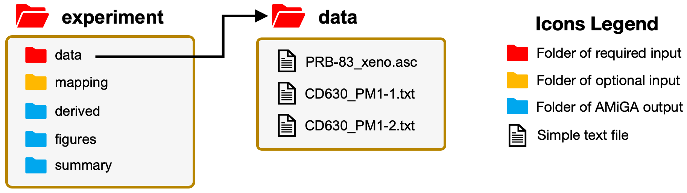
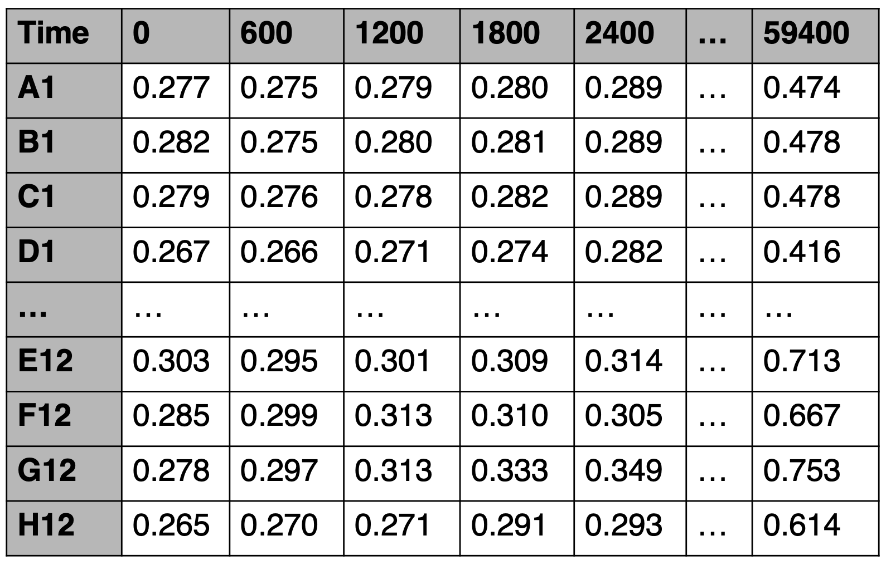

<!-- AMiGA is covered under the GPL-3 license -->

**Table of Contents**

* TOC
{:toc}
<br />

#### Organizing your working directory

Before you begin with your first analysis, you need to create a folder which we will refer to as the __Working Directory__. Here, I name my example as __experiment__. In this folder, you must have a __data__ sub-folder where you will save all of your data files that need to be analyzed. The folders highlighted in blue will be automatically generated by `AMiGA`. The `mapping` folder in orange is an optional folder that you can use to pass meta-data and other similar information to `AMiGA`. See [Preparing Metadata](/amiga/doc/metadata.html) for more details.

<br />

{:width="500px"}
<!--- {:class="img-responsive"} -->

<br />

#### Preparing your plate reader data files

`AMiGA` is designed for the analysis of plate reader data. Plate readers typically measure the optical density in every well of a 96-well microplate at fixed time intervals (e.g. every 10 minutes). These files are often saved as `.TXT` or `.ASC` files and may contain run information such as protocol, temperature, ... etc., in the first few lines of the text file. After the run information, data will typically look like the following example. Here, the first column is the well location which is a unique identifier of each well. The  first row is the time measurement. The cell values are the measured optical density in each well at a specific time point.

<br />

{:width="400px"}
<!--- {:class="img-responsive"} -->

<br />

Plate readers use different proprietary softwares that export data in slightly different formats. To avoid confusion due to different formats, `AMiGA` will ignore the time row and will not read it. Instead, it will detect the first line that starts with a well location (e.g. A1 or D13) and read all subsequent lines. Other lines in the text file will simply be ignored. `AMiGA` will instead rely on the `Interval` parameter to define the time points. By default this value is 600 seconds (or 10 minutes) but the user can over-ride the default value in the `libs/config.py` file (see [Configure default parameters](/amiga/doc/configuration.html)) or by passing another `Interval` value as an argument. See [Command-line Interface](/amiga/doc/command-line-interface.html) for more details. The defaults must be in seconds but you can also replace the time unit default in `libs/config.py`.

<br /><br />

#### Naming your plate reader data files

Please use mostly alphanumeric characters in your file names. It is okay to include simple characters such as underscores and dashes.

If you are analyzing Biolog Phenotype Microarray (PM) plates, you can name your data file in a specific way and ```AMiGA``` will automatically recognize it as a Biolog PM plate, identify the content in each well on your plate, and include these details in the summary of your growth curves. To do so, please use this nomenclature:

`{isolate name}_PM{integer}-{integer}`

where the isolate name can be composed of any alphanumeric characters, the first integer indicates the PM number (must be between and including 1 and 7), and the second integer indicates the replicate number. For example, `CD630_PM3-2.txt` corresponds to the second replicate of growing the isolate `CD630` on `PM3`.

<br /><br />

#### Frequently Asked Questions (FAQ)

__Which file formats can AMiGA read?__

AMiGA can only read tab-delimited text files which is the typical format for output by plate readers. These can be encoded in ASCII or BOM (e.g. UTF-8). If you have a comma-separated file, you must convert it to tab-delimited or tab-separated file instead.

__Can AMiGA read a Microsoft Excel file?__

No, please convert the file to tab-delimited text file.

__Does AMiGA only process 96-well plates? Can it process 384-well plates? How about data files with an arbitrary number of wells/rows?__

AMiGA can read and process data files with any arbitrary number of wells/rows, including 96-well and 384-well plates. It can even read a plate with a single well/row. However, the row names must be well locations (e.g. A1, B1, ..., etc.) where first character is an alphabetic letter that corresponds to a specific row in the plate and remaining characters are digits that corresponds to a specific column in the plate

__Can AMiGA analyze CFU counts or fluorescence data instead of optical density?__

AMiGA should be able to analyze any type of measurement over time, with a couple of caveats. First, AMiGA would need a minimum number of time points to properly fit growth curves (aim for at least eight time points). Second, optical density values typically range between 0 and 5. Fluorescence units are often measured in the thousands. Extreme values or dynamic ranges for measurements could result in numerical instability for GP regression. 
