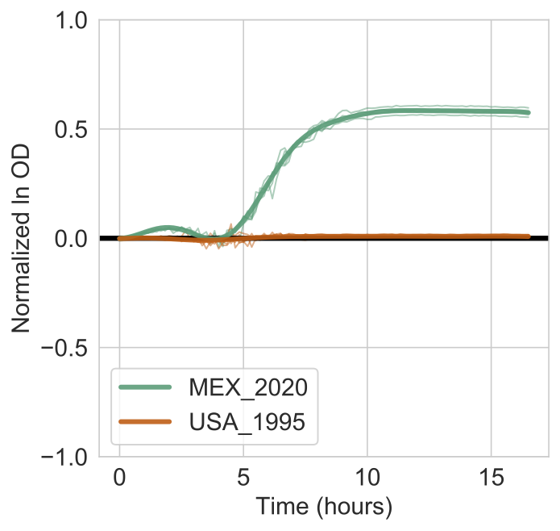
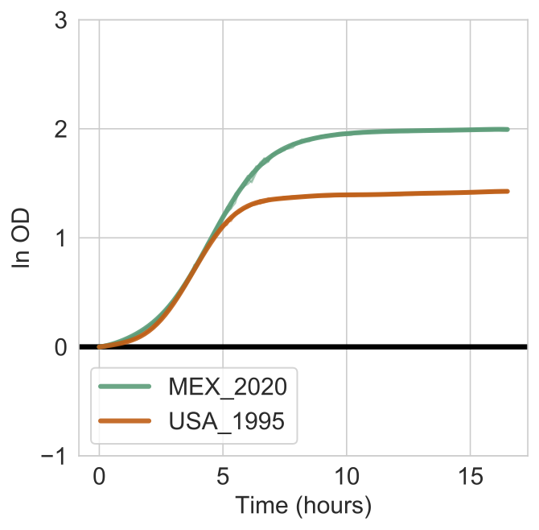

<!-- AMiGA is covered under the GPL-3 license -->
**Table of Contents**

* TOC
{:toc}
<br />

`AMiGA` can perform Gaussian Process (GP) regression to test differential growth between distinct experimental conditions.o see the full list of arguments that `AMiGA` will accept for its `test` function, call `python amiga.py test --help`. 

<br/>

#### Basic usage

```bash
python amiga.py test \
	-i /home/outbreaks/erandomii/ \
	-s Isolate:ER1;PM:1;Substrate:Negative Control,alpha-D-glucose \
	-y H0:Time;H1:Time+Substrate \
	-tss 10 --subtract-control
```

Here, we first reduced our data set only to the growth curves of the isolate `ER1` in `PM1` plates on `Negative Control` (i.e. no carbon) and `alpha-D-glucose` wells. We then test the null hypothesis (`H0`) that only `Time` variable explains variation in OD against the alternative hypothesis (`H1`) that both `Time` and `Substrate` variables explain the variation in OD.

`AMiGA` will process your request and create a sub-folder in `models` with several files including:

- `key`: reduced mapping file for your request.
- `input`: data used for hypothesis testing (e.g. Time, OD, ..., etc) in long-format.
- `report`: summary of the the results of the GP regression test.
- `log`: a one-line version of the report summary. 
- `params`: growth parameters for the growth curves predicted by th model.
- `pdf`: plot of the data tested with GP Regression.

<br/>
#### Functional difference in OD

In addition to the log Bayes Factor scores, `AMiGA` will compute the functional difference in the OD between the compared growth curve. This will plot the difference in OD (and its credible interval) over time. In addition, it will summarize the functional difference in OD using $$\Vert OD\Delta\Vert$$ which is reported in the `log` folder as `delta_od_sum` and `delta_od_sum_sig`. See Midani et al. (2020) for description of these summary metrics. 

<br/> 

#### Interpretation of model output

See [Example](/amiga/doc/example.html) for more details on the context of this example. 

```bash
python amiga.py test \
  -i /home/outbreaks/erandomii \
  -s "Substrate:L-Lactic Acid" \
  -y "H0:Time;H1:Time+Strain" \
  -o "strain_difference_l_lactic_acid" \
  -np 99 -tss 3 --verbose
```

If you run the above command using the example data, a figure will show the models estimated for each strain (bold lines) overlaid on the actual data (thin lines). Shaded bands indicate the 95% confidence interval for the models.

{:width="400px"}

<br />

The output report will look like this:

```
The following criteria were used to subset data:
Substrate......['L-Lactic Acid']

The following hypothesis was tested on the data:
{'H0': ['Time'], 'H1': ['Time', 'Strain']}

log Bayes Factor = 666.990 (0.0-percentile in null distribution based on 100 permutations)

For P(H1|D) > P(H0|D) and FDR <= 10%, log BF must be > 0.937
For P(H0|D) > P(H1|D) and FDR <= 10%, log BF must be < -0.000

The functional difference [95% CI] is 4.300 [4.119,4.481]

Data Manipulation: Input was reduced to 34 equidistant time points. Samples were normalized to their respective control samples before analysis.
```

This indicates that the log Bayes Factor is 666.99 and much higher than the 10% FDR threshold of 0.937. You are thus very confident that Lactic Acid supports the growth of the MEX_2020 strain but not the USA_1995 strain.

Recall that

$$\text{Bayes Factor} = \exp\left({\log \text{Bayes Factor}}\right) = \exp{(750.722)}$$

and

$$\text{Bayes Factor} = \frac{P(H1|D)}{P(H0|D)}$$

Therefore, the analysis suggests that the alternative hypothesis that strain differences contributes to differences in growth is more supported than the null hypothesis that only time explains variations in optical density measurements.

<br />
#### Limitations of hypothesis testing

- Testing can only be performed to compare two conditions. In the above example, we compared the growth on the glucose well against growth on the control well.
- If you are comparing data spread across multiple plates, there will be batch effects. To somewhat account for this, `AMiGA` can subtract the growth in control wells from each of your growth curves. To do this, you can use the `--subtract-control` argument. If you did not specify the control wells in your mapping files, `AMiGA` will not be able to subtract growth in control wells and may eschew this step or the testing may fail. 

So for the above example, we can re-run it without the `--subtract-control` argument and we will get the following figure.  

```bash
python amiga.py test \
  -i /home/outbreaks/erandomii \
  -s "Substrate:L-Lactic Acid" \
  -y "H0:Time;H1:Time+Strain" \
  -o "strain_difference_l_lactic_acid" \
  -np 99 -tss 3 --verbose
```

{:width="400px"}

Notice how the OD is overall higher for both curves becasue it does not subtract the growth expected or observed on minimal media fore ach strain. By comparing both figures, you can see that all of the growth for USA_1995 on L-Lactic Acid is attributed to the growth simply on minimal media. 

<br/>

#### Plotting aesthetics

Users can adjust some of the options for the plotting of the models produced by the `test` functions. In the `libs/config.py` file (see [Configure default parameters](/amiga/doc/configuration.html)), you will find the following key-value pairs:

```bash
config['HypoPlotParams'] = {'overlay_actual_data':True,
                           'fontsize':15,
                           'tick_spacing':5,
                           'legend':'inside'}
```

- `overaly_actual_data` allows you to include the raw growth curves used by the model (options are either `True` or `False`).
- `fontsize` allows you to adjust the size of the font. 
- `tick_spacing` allows you to adjust the interval for the y-axis grid (or ticks), default is `5` hours. Recall, that you can also adjust the units of time in the `libs\config.py` file as well.
- `legend` allows to either include the legend box ```'inside'``` or ```'outside'```; the value must be in single quotes. 

<br/>

#### Command-Line arguments

To see the full list of arguments that `amiga test` will accept, run

```bash
python amiga.py test --help
```
which will return the following message

```bash
usage: amiga.py [-h] -i INPUT [-o OUTPUT] [-f FLAG] [-s SUBSET] [-t INTERVAL]
                -y HYPOTHESIS [-sfn SKIP_FIRST_N] [-tss TIME_STEP_SIZE]
                [-np NUMBER_PERMUTATIONS] [-fdr FALSE_DISCOVERY_RATE]
                [--confidence CONFIDENCE] [--subtract-blanks]
                [--subtract-control] [--verbose] [--fix-noise]
                [--include-gaussian-noise] [--sample-posterior] [--dont-plot]
                [--dont-plot-delta-od] [--save-cleaned-data]
                [--save-mapping-tables] [--save-gp-data] [--merge-summary]

Test for differential growth between two conditions

optional arguments:
  -h, --help            show this help message and exit
  -i INPUT, --input INPUT
  -o OUTPUT, --output OUTPUT
  -f FLAG, --flag FLAG
  -s SUBSET, --subset SUBSET
  -t INTERVAL, --interval INTERVAL
  -y HYPOTHESIS, --hypothesis HYPOTHESIS
  -sfn SKIP_FIRST_N, --skip-first-n SKIP_FIRST_N
  -tss TIME_STEP_SIZE, --time-step-size TIME_STEP_SIZE
  -np NUMBER_PERMUTATIONS, --number-permutations NUMBER_PERMUTATIONS
  -fdr FALSE_DISCOVERY_RATE, --false-discovery-rate FALSE_DISCOVERY_RATE
  --confidence CONFIDENCE
                        Must be between 80 and 100. Default is 95.
  --subtract-blanks
  --subtract-control
  --verbose
  --fix-noise
  --include-gaussian-noise
  --sample-posterior
  --dont-plot
  --dont-plot-delta-od
  --save-cleaned-data
  --save-mapping-tables
  --save-gp-data
  --merge-summary
```

<br/>
See more details for these arguments in [Command Line Interface](/amiga/doc/command-line-interface.html)
