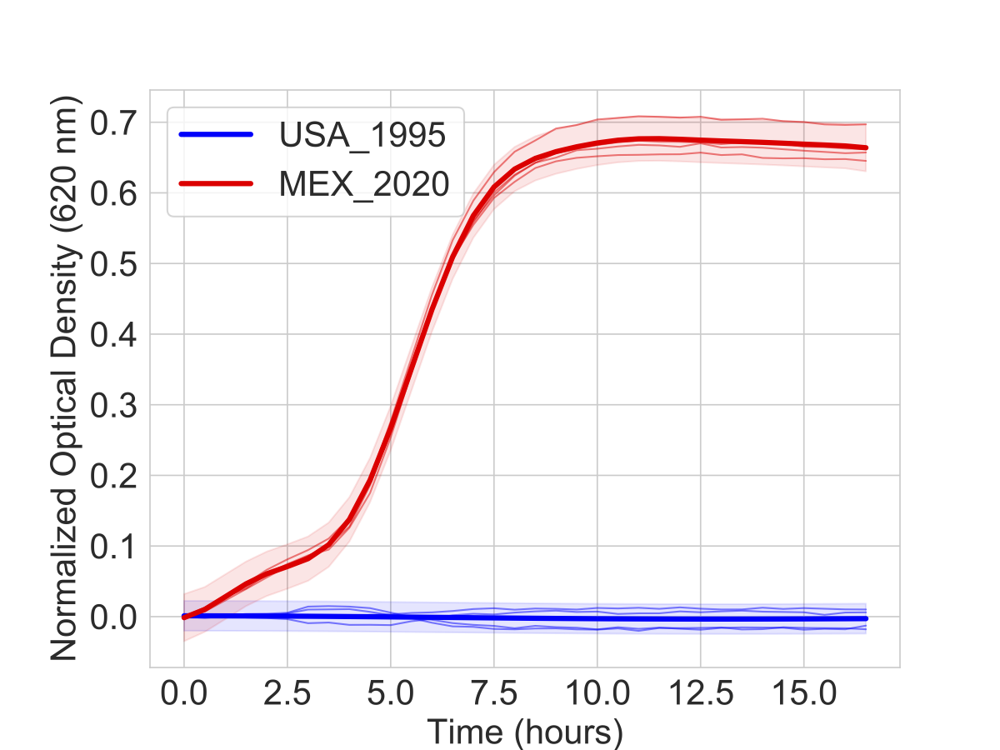

<!-- AMiGA is covered under the GPL-3 license -->

`AMiGA` can perform Gaussian Process (GP) regression to test differential growth between distinct experimental conditions.

<br/>

**Example One**

```bash
python amiga.py -i /home/outbreaks/erandomii/ -s Isolate:ER1;PM:1;Substrate:Negative Control,alpha-D-glucose -y H0:Time;H1:Time+Substrate -tss 10 --subtract-control
```

Here, we first reduced our data set only to the growth curves of the isolate `ER1` in `PM1` plates on `Negative Control` (i.e. no carbon) and `alpha-D-glucose` wells. We then test the null hypothesis (`H0`) that only `Time` variable explains variation in OD against the alternative hypothesis (`H1`) that both `Time` and `Substrate` variables explain the variation in OD.

`AMiGA` will process your request and create a sub-folder in `models` with several files including:

- `key`: reduced mapping file for your request.
- `input`: data used for hypothesis testing (e.g. Time, OD, ..., etc) in long-format.
- `report`: summary of the the results of the GP regression test.
- `log`: a one-line version of the report summary. 
- `params`: growth parameters for the growth curves predicted by th model.
- `pdf`: plot of the data tested with GP Regression.

<br/>
**Functional difference in OD**

In addition to the log Bayes Factor scores, `AMiGA` will compute the functional difference in the OD between the compared growth curve. This will plot the difference in OD (and its credible interval) over time. In addition, it will summarize the functional difference in OD using $$\Vert OD\Delta\Vert$$ which is reported in the `log` folder as `delta_od_sum` and `delta_od_sum_sig`. See Midani et al. (2020) for description of these summary metrics. 

<br/> 
**Limitations of hypothesis Testing:**

- Testing can only be performed to compare two conditions. In the above example, we compared the growth on the glucose well against growth on the control well.
- If you are comparing data spread across multiple plates, there will be batch effects. To account for this, `AMiGA` can subtract the grwoth in control wells from each of your growth curves. To do this, you can use the `--subtract-control` argument.

<br/>

**Interpretation of model output**

See [Example](/amiga/doc/example.html) for more details on the context of this example.

The figure will show the models estimated for each strain (bold lines) overlaid on the actual data (thin lines). Shaded bands indicate the 95% confidence interval for the models.

{:width="400px"}

<br />

The output report will look like this:

```
The following criteria were used to subset data:
Substrate......['L-Lactic Acid']

The following hypothesis was tested on the data:
{'H0': ['Time'], 'H1': ['Time', 'Strain']}

log Bayes Factor: 750.522 (0.0-percentile in null distribution based on 100 permutations)

For P(H1|D) > P(H0|D) and FDR <= 10%, log BF must be > 0.696
For P(H0|D) > P(H1|D) and FDR <= 10%, log BF must be < -4.34e-06

Data Manipulation: Input was reduced to 34 time points. Samples were normalized to relevant control samples before modelling.
```

This indicates that the log Bayes Factor is 750.522 and much higher than the 10% FDR threshold of 0.696. You are every confident that Lactic Acid supports the growth of the MEX_2020 strain but not the USA_1995 strain.

Recall, that

$$\text{Bayes Factor} = \exp{\log \text{Bayes Factor}} = \exp{(750.722)}$$

and

$$\text{Bayes Factor} = \frac{P(H1|D)}{P(H0|D)}$$

Therefore, the analysis suggest that alternative hypothesis that strain differences contributes to differences in growth is more supported than the null hypothesis that only time explains variations in optical density measurements.
