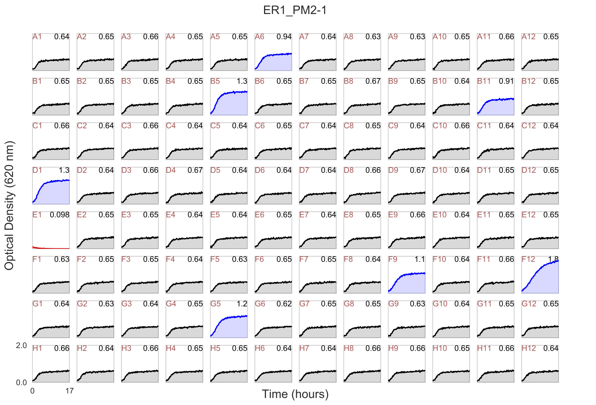

Let us assume that my working directory is

`/Users/firasmidani/experiment`

and I stored my plate reader file in the `data` sub-folder

`/Users/firasmidani/experiment/data/PRB951_PM1-1.asc`

Make sure that you are inside the `AMiGA` directory

```bash
cd /Users/firasmidani/amiga
```

If you simply would like to plot the raw data in a 96-well grid, you can run the following:

```bash
python main.py -i /Users/firasmidani/experiment/data/PRB951_PM1-1.asc --only-plot-plate
```

In your `/Users/firasmidani/experiment/figures` folder, you will find `PRB951_PM1-1.pdf`

<br /><br />

{:width="800px"}

This example shows a Biolog PM1 plate where the A1 well is a negative control well (no carbon substrate). `AMiGA` computed the fold-change for all wells relative to each well. Fold-change is computed as maximum change in OD in each well relative to the fist time point divided by the maximum change in OD in the control well relative to the first time point. `AMiGA` highlighted wells where the fold-change is higher than 1.5 in blue or lower than 0.5 in red. If you want to change the default values for these thresholds, choice of colors, or y-axis label, you make changes to the parameters in `amiga/config.py` file.
